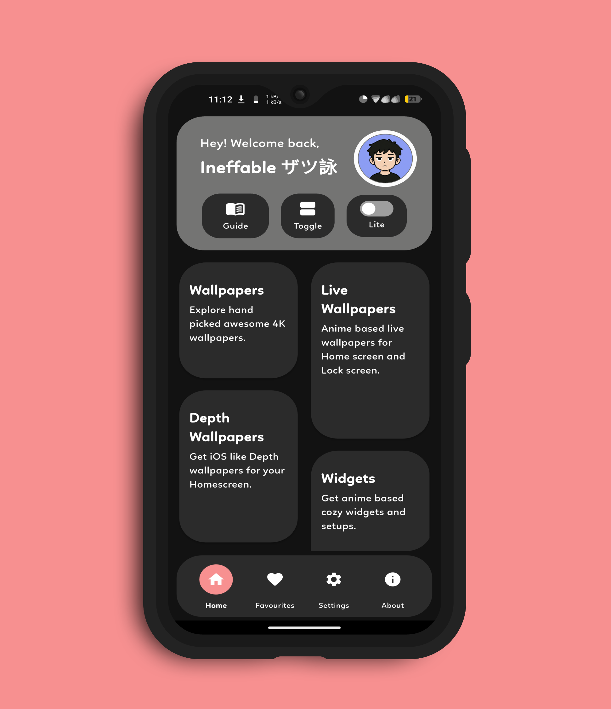
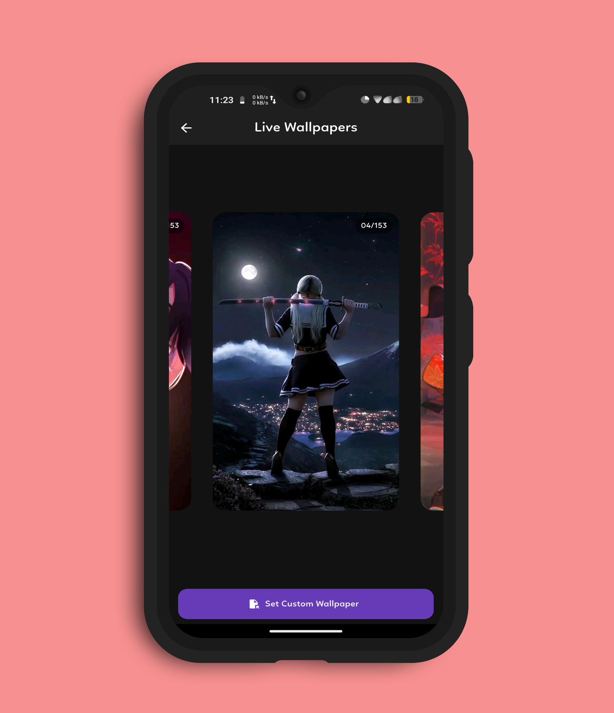
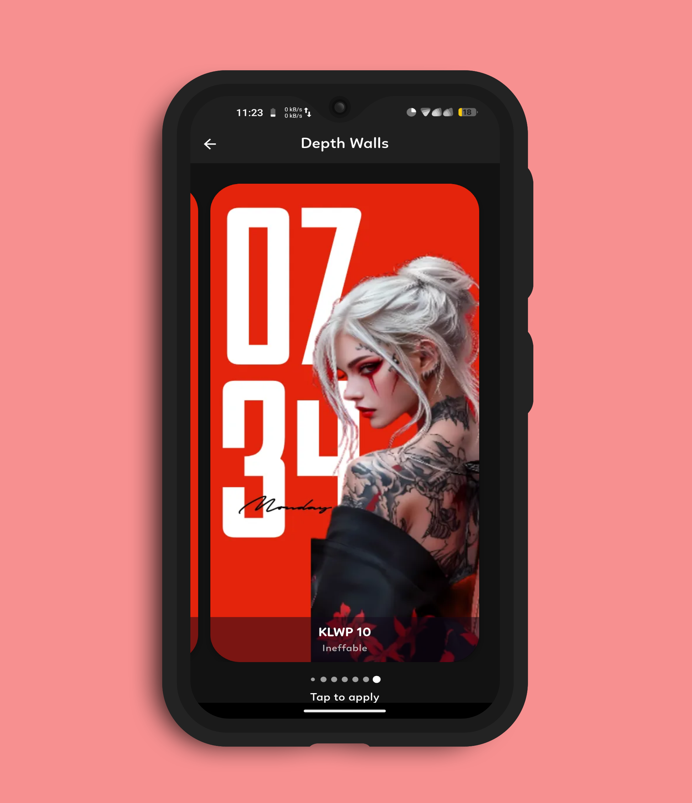
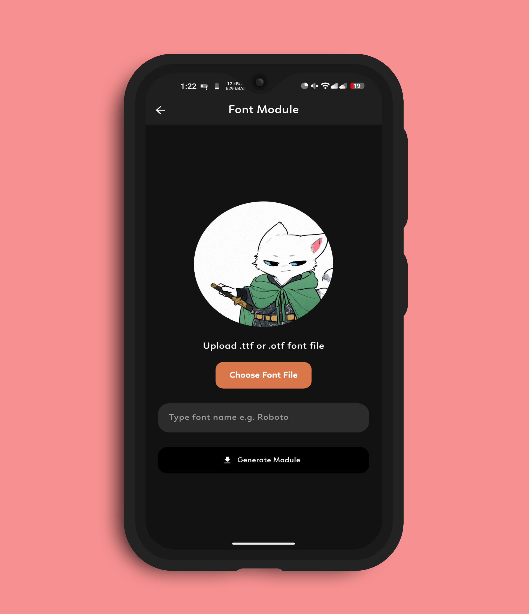
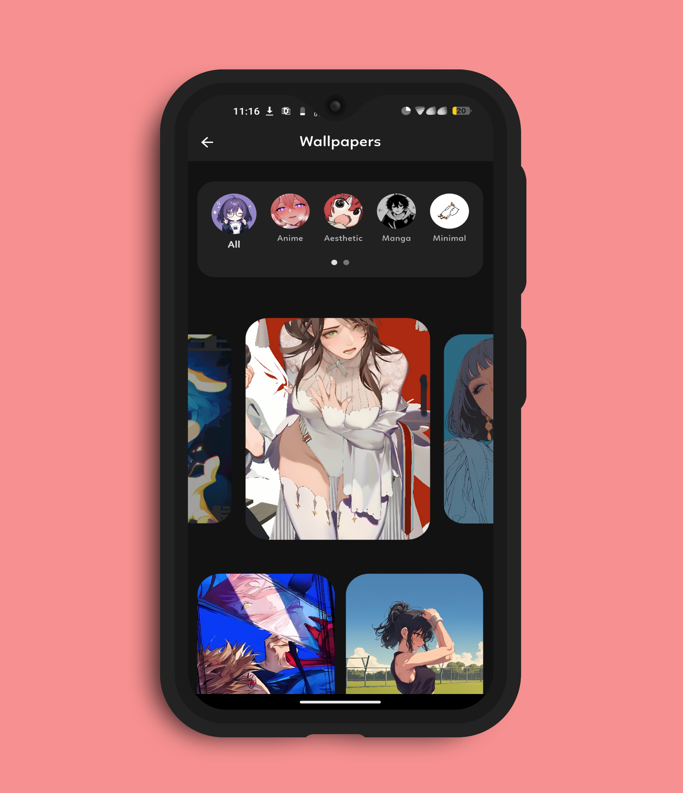
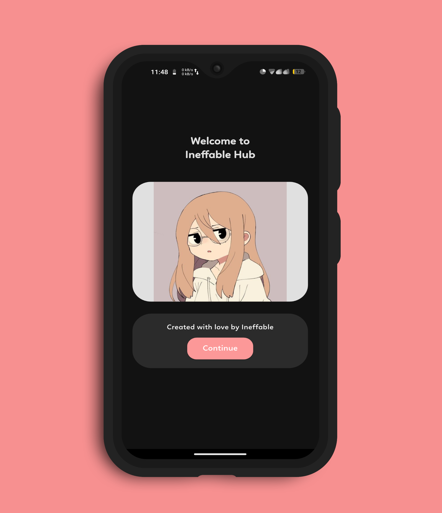
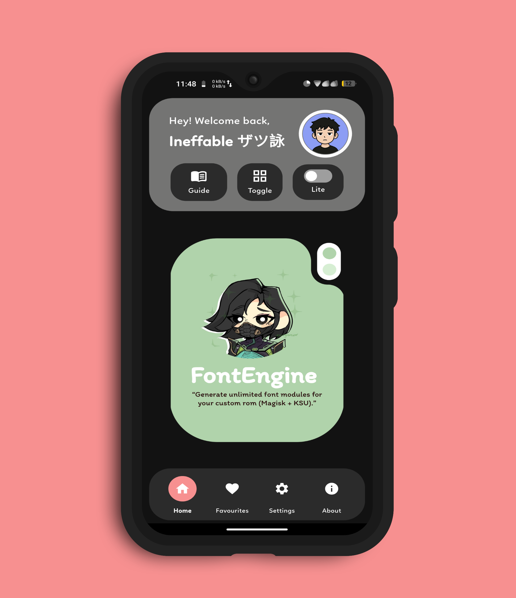
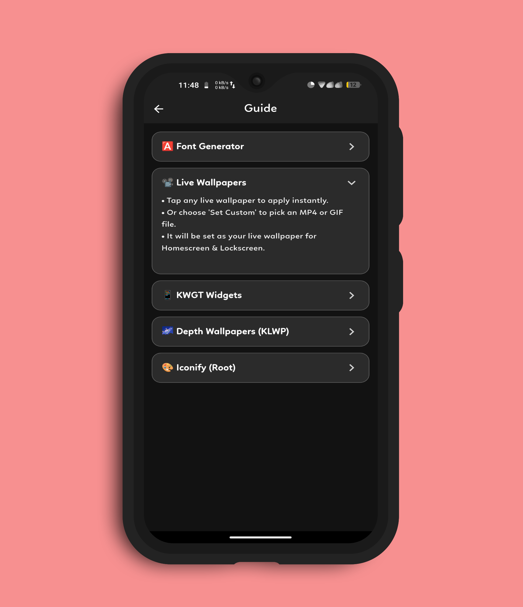

<h1 align="center">✨ <strong>Ineffable Hub</strong> ✨</h1>
<h3 align="center">The Ultimate Android Personalization Suite</h3>

Built with ❤️ using Flutter – Make your device truly yours.

---

## 📱 What is Ineffable Hub?

**Ineffable Hub** is an all-in-one Android personalization toolkit designed for both casual users and deep customizers.  
Crafted with Flutter, it blends aesthetic design, powerful features, and a fluid UI to give you complete control over your Android experience.

---

## 🌟 Features at a Glance

### 🎞️ Live Wallpapers  
Apply beautiful animated wallpapers or use your **own videos or gif** as dynamic wallpaper for lockscreen & homescreen.

### 🌀 Depth Wallpapers  
Inspired by **iOS** & **HyperOS** – get depth clocks for Home screen.

### 📦 Themes & Home Setups  
Complete KWGT-based layouts including widgets, Home setups – ready to apply.

### 🔤 Font Engine (Android 10–16)  
Generate **flashable font modules** for Magisk / KSU / KSU-Next with just one tap.

### 🎨 Iconify  
Pre-customized configurations with QS headers, icon theming, qs layouts, and UI refinements.

### 🧊 Icon Packs  
A curated library of aesthetic, minimal and material icon packs for every vibe.

### 🖌️ Beautiful UI  
Material You (M3) design with smooth transitions.  

---

<h2 align="center">📸 Screenshots</h2>

  
  
  

  
  
  

  
  

---

## ⚙️ Built With

- 🧩 Flutter  
- 💡 Dart  
- 🎨 Material 3 (Material You)

---

## 📥 Download Now

🔗 Follow the [GitHub Repo](https://github.com/ineffablexd/Ineffable-hub) to get started and download the app.

---

## 🌍 Join the Community

📢 **Telegram Update Channel** – [@ineffablehub](https://t.me/ineffablehub)  
💬 **Discussion Group** – [@flexify_discussion](https://t.me/flexify_discussion)  
👨‍💻 **Created By** – [@ineffabletg](https://t.me/ineffabletg)

---

## 🧠 Credits & Inspiration

Thanks to [@darkdevil7773](https://t.me/darkdevil7773) for upscaling wallpapers and suggesting ui designes.
